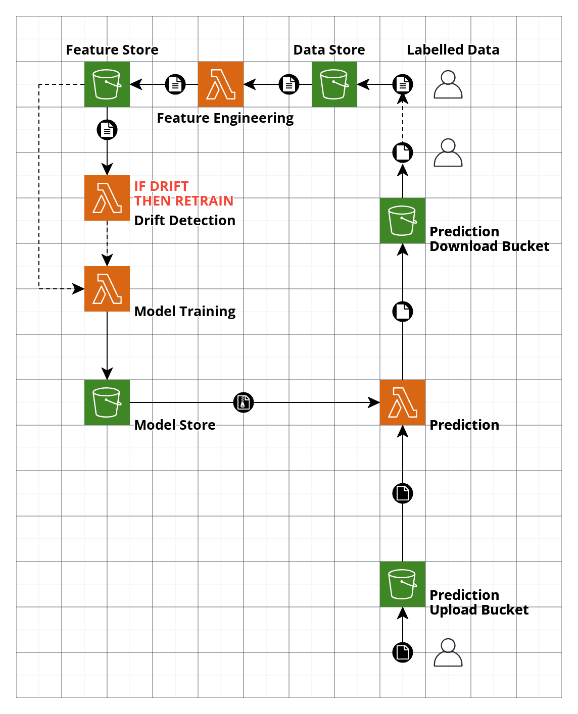

# UCI Bank Marketing App

Simple web app that predicts the probabilty of a customer subscribing to a banking product.

## Run app

Build docker container:

`docker build --tag uci-bank-marketing-app .`

Run docker container:

`docker run --publish 8000:5000 uci-bank-marketing-app`

NOTE: The model, categorical feature encoder and numerical feature scaler are pulled from an S3 bucket, so it might take some time for the app to spin up when running locally.

## Post to API

The app API accepts JSON in the format:

```
data = [{"age": 17,
        "job": "blue-collar",
        "marital": "married",
        "education": "tertiary",
        "default": "no",
        "balance": 3050,
        "housing": "yes",
        "loan": "yes",
        "contact": "unknown",
        "day": 3,
        "month": "may",
        "campaign": 1,
        "pdays": 999,
        "poutcome": "failure",
        "previous": 0,
        }]
```

The app will return the prediction in the format:

`result = {"probability": 0.34}`

You can test posting to the app locally by running the `post.py` script from a separate shell:

`python3 post.py`

## Model training

Details of the data cleaning, feature engineering and model training can be found in the `train_model.ipynb` notebook.

## Proposed Serverless Architecture

NOTE: The current app would need to be rewritten slightly to allow it to work with AWS Lambda.



## TODO

- [ ] Add tests
- [ ] Add error codes to API
- [ ] Make async i.e. move to FastAPI (starlette + uvicorn)